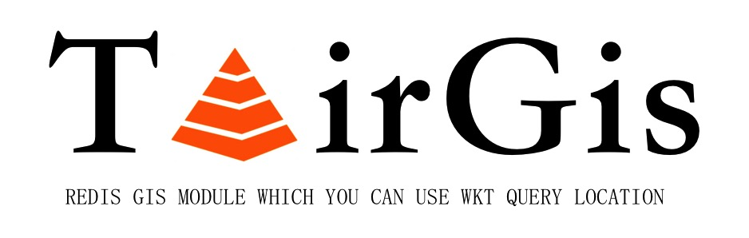

<div align=center>

</div>

## Introduction [中文介绍](README-CN.md)
TairGis is a Redis Module that supports the query of `intersection`, `contains`, and `within` relationships between `points`, `lines`, and `polygons`. It has the following features:
- Fast query performance
- Use `RTree` storage
- The function of Redis `GEORADIUS` [command](https://redis.io/commands/georadius) can be realized through `GIS.SEARCH`

## Acknowledgments
Special thanks to https://github.com/tidwall/redis-gis, TairGis relies on redis-gis and fixes some of its problems.

## Quick Start
```
// Insert a POLYGON
127.0.0.1:6379> GIS.ADD hangzhou campus 'POLYGON ((120.028041 30.285179, 120.031203 30.28691, 120.037311 30.286239, 120.034185 30.280844))'
(integer) 1
// Query POLYGON
127.0.0.1:6379> GIS.GET hangzhou campus
"POLYGON((120.028041 30.285179,120.031203 30.28691,120.037311 30.286239,120.034185 30.280844))"
// Determine if the points 'POINT (120.031939 30.285179)' and POLYGON contain
127.0.0.1:6379> GIS.CONTAINS hangzhou 'POINT (120.031939 30.285179)'
1) (integer) 1
2) 1) "campus"
   2) "POLYGON((120.028041 30.285179,120.031203 30.28691,120.037311 30.286239,120.034185 30.280844))"
// Determine if line and POLYGON intersect
127.0.0.1:6379> GIS.INTERSECTS hangzhou 'LINESTRING (120.029622 30.288952, 120.035488 30.280056)'
1) (integer) 1
2) 1) "campus"
   2) "POLYGON((120.028041 30.285179,120.031203 30.28691,120.037311 30.286239,120.034185 30.280844))"
127.0.0.1:6379>
```

## BUILD
```
make
```
After the compilation is successful, the `tairgis.so` file will be generated in the current directory, next, load it with Redis.
```
./redis-server --loadmodule /path/to/tairgis.so
```

## Test
Edit tests/tairgis.tcl first line: `set testmodule [file your_path/tairgis.so]`

Copy tairgis.tcl in the tests directory to tests in the redis directory
```  
cp tests/tairgis.tcl your_redis_path/tests
```
Add tairgis to all_tests in test_helper.tcl of redis
```      
diff --git a/tests/test_helper.tcl b/tests/test_helper.tcl
index 1a5096937..d5a1ba40a 100644
--- a/tests/test_helper.tcl
+++ b/tests/test_helper.tcl
@@ -13,6 +13,7 @@ source tests/support/test.tcl
source tests/support/util.tcl

set ::all_tests {
+    tairgis
```  
Run ./runtest --single tairgis in the redis root directory

## Clients

| language | GitHub |
|----------|---|
| Java     |https://github.com/alibaba/alibabacloud-tairjedis-sdk|
| Python   |https://github.com/alibaba/tair-py|
| Go       |https://github.com/alibaba/tair-go|
| .Net     |https://github.com/alibaba/AlibabaCloud.TairSDK|

## API

### GIS.ADD
#### Syntax and Complexity
> GIS.ADD area polygonName polygonWkt [polygonName polygonWkt ...]  
> Time complexity: O(log n)

#### Command description
> Add polygons with the specified name (multiple ones can be added) in the area, and use WKT (Well-known text) description. WKT is a text markup language for describing vector geometric objects,
> Spatial reference system and conversion between spatial reference systems.

#### Parameter Description
> area: a geometric concept.  
> polygonName: The name of the polygon.  
> polygonWkt: The description information of the polygon, which represents the longitude and latitude of the real world. It is described by WKT (Well-known text) and supports the following types.  
> - POINT: Describes the WKT information of a point, such as 'POINT (120.086631 30.138141)', which means that the POINT is located at 120.086631 longitude and 30.138141 latitude.
> - LINESTRING: WKT information describing a line, consisting of two POINTs, such as 'LINESTRING (30 10, 40 40)'.
> - POLYGON: Describes the WKT information of a polygon, consisting of multiple POINTs, such as 'POLYGON ((31 20, 29 20, 29 21, 31 31))'.  
> 
> Description: The value range of longitude is (-180,180), and the value range of latitude is (-90,90). The following collection types are not supported: MULTIPOINT, MULTILINESTRING, MULTIPOLYGON, GEOMETRY, and COLLECTION.

#### return value
> Executed successfully: Returns the number of polygons inserted and updated successfully.   
> In other cases, return the corresponding exception information.

#### Example
````
127.0.0.1:6379> GIS.ADD hangzhou campus 'POLYGON ((30 10, 40 40, 20 40, 10 20, 30 10))'
(integer) 1
127.0.0.1:6379>
````

### GIS.GET
#### Syntax and Complexity
> GIS.ADD area polygonName  
> Time complexity: O(1)

#### Command description
> Get the WKT information of the specified polygon in the target area.

#### Parameter Description
> area: a geometric concept.  
> polygonName: The name of the polygon.  

#### return value
> Successful execution: WKT information.  
> area or polygonName does not exist: nil.  
> In other cases, return the corresponding exception information.

#### Example
````
Execute the GIS.ADD hangzhou campus 'POLYGON ((30 10, 40 40, 20 40, 10 20, 30 10))' command in advance

127.0.0.1:6379> GIS.GET hangzhou campus
"POLYGON((30 10,40 40,20 40,10 20,30 10))"
127.0.0.1:6379>
````

### GIS.GETALL
#### Syntax and Complexity
> GIS.ADD area [WITHOUTWKT]  
> Time complexity: O(n)

#### Command description
> Get the names and WKT information of all polygons in the target area. If the WITHOUTWKT option is set, only the name of the polygon is returned.

#### Parameter Description
> area: a geometric concept.  
> WITHOUTWKT: It is used to control whether to return the WKT information of the polygon. If this parameter is added, the WKT information of the polygon will not be returned.

#### return value 
> Successful execution: Returns the polygon name and WKT information. If the WITHOUTWKT option is set, only the polygon name is returned.  
> area does not exist: nil.  
> In other cases, return the corresponding exception information.  

#### Example
````
Execute the GIS.ADD hangzhou campus 'POLYGON ((30 10, 40 40, 20 40, 10 20, 30 10))' command in advance

127.0.0.1:6379>GIS.GETALL hangzhou
1) "campus"
2) "POLYGON((30 10,40 40,20 40,10 20,30 10))"
127.0.0.1:6379>
````

### GIS.DEL
#### Syntax and Complexity
> GIS.DEL area polygonName  
> Time complexity: O(log n)

#### Command description
> Delete the specified polygons in the target area.

#### Parameter Description
> area: a geometric concept.  
> polygonName: The name of the polygon.

#### return value
> Successful execution: OK.  
> area or polygonName does not exist: nil.  
> In other cases, return the corresponding exception information.  

#### Example
````
Execute the GIS.ADD hangzhou campus 'POLYGON ((30 10, 40 40, 20 40, 10 20, 30 10))' command in advance

127.0.0.1:6379> GIS.DEL hangzhou campus
OK
127.0.0.1:6379>
````

### GIS.CONTAINS
#### Syntax and Complexity
> GIS.CONTAINS area polygonWkt [WITHOUTWKT]  
> Time complexity: O(log M n) at best, O(log n) at worst

#### Command description
> Determine whether the specified point, line or surface is included in the polygon of the target area. If so, return the number of polygons and polygon information hit in the target area.

#### Parameter Description
> area: a geometric concept.  
> polygonWkt: Specifies the polygon description information to be compared with the target area, using WKT (Well-known text) description, supports the following types.  
> - POINT: WKT information describing a point.
> - LINESTRING: WKT information describing a line.
> - POLYGON: WKT information describing a polygon.
>
> WITHOUTWKT: It is used to control whether to return the WKT information of the polygon. If this parameter is added, the WKT information of the polygon will not be returned.

#### return value
> Successful execution: number of hit polygons and polygon information.  
> area does not exist: empty list or set.  
> In other cases, return the corresponding exception information.  

#### Example
````
Execute the GIS.ADD hangzhou campus 'POLYGON ((30 10, 40 40, 20 40, 10 20, 30 10))' command in advance

127.0.0.1:6379> GIS.CONTAINS hangzhou 'POINT (30 11)'
1) (integer) 1
2) 1) "campus"
   2) "POLYGON((30 10,40 40,20 40,10 20,30 10))"
127.0.0.1:6379>
````

### GIS.WITHIN
#### Syntax and Complexity
> GIS.WITHIN area polygonWkt [WITHOUTWKT]  
> Time complexity: O(log M n) at best, O(log n) at worst  

#### Command description
> Determine whether the target area is contained in the specified point, line or surface. If so, return the number of polygons and polygon information hit in the target area.

#### Parameter Description
> area: a geometric concept.  
> polygonWkt: Specifies the polygon description information to be compared with the target area, using WKT (Well-known text) description, supports the following types.  
> - POINT: WKT information describing a point.
> - LINESTRING: WKT information describing a line.
> - POLYGON: WKT information describing a polygon.
>
> WITHOUTWKT: It is used to control whether to return the WKT information of the polygon. If this parameter is added, the WKT information of the polygon will not be returned.

#### return value
> Successful execution: number of hit polygons and polygon information.  
> area does not exist: empty list or set.  
> In other cases, return the corresponding exception information.  

#### Example
````
Execute the GIS.ADD hangzhou campus 'POLYGON ((30 10, 40 40, 20 40, 10 20, 30 10))' command in advance

127.0.0.1:6379> GIS.WITHIN hangzhou 'POLYGON ((30 5, 50 50, 20 50, 5 20, 30 5))'
1) (integer) 1
2) 1) "campus"
   2) "POLYGON((30 10,40 40,20 40,10 20,30 10))"
127.0.0.1:6379>
````

### GIS.INTERSECTS
#### Syntax and Complexity
> GIS.INTERSECTS area polygonWkt [WITHOUTWKT]  
> Time complexity: O(log M n) at best, O(log n) at worst

#### Command description
> Determine whether the specified point, line or surface intersects with the polygon of the target area. If so, return the number of polygons and polygon information in the target area that intersect with it.

#### Parameter Description
> area: a geometric concept.  
> polygonWkt: Specifies the polygon description information to be compared with the target area, using WKT (Well-known text) description, supports the following types.  
> - POINT: WKT information describing a point.
> - LINESTRING: WKT information describing a line.
> - POLYGON: WKT information describing a polygon.
>
> WITHOUTWKT: It is used to control whether to return the WKT information of the polygon. If this parameter is added, the WKT information of the polygon will not be returned.

#### return value
> Successful execution: number of hit polygons and polygon information.  
> area does not exist: empty list or set.  
> In other cases, return the corresponding exception information.   

#### Example
````
Execute the GIS.ADD hangzhou campus 'POLYGON ((30 10, 40 40, 20 40, 10 20, 30 10))' command in advance

127.0.0.1:6379> GIS.INTERSECTS hangzhou 'LINESTRING (30 10, 40 40)'
1) (integer) 1
2) 1) "campus"
   2) "POLYGON((30 10,40 40,20 40,10 20,30 10))"
127.0.0.1:6379>
````

### GIS.SEARCH
#### Syntax and Complexity
> GIS.SEARCH area [RADIUS longitude latitude distance m|km|ft|mi]  
> [MEMBER field distance m|km|ft|mi]   
> [GEOM geom]  
> [COUNT count]  
> [ASC|DESC]  
> [WITHDIST]   
> [WITHOUTWKT]     
> Time complexity: O(log M n) at best, O(log n) at worst

#### Command description
> Find the point in the target area within the specified longitude, latitude and radius distance.  

#### Parameter Description
> area: a geometric concept.  
> RADIUS: Enter longitude, latitude, distance and radius units (m for meters, km for kilometers, ft for feet, mi for miles) to search, for example RADIUS 15 37 200 km .  
> MEMBER: Select the existing POINT in the current area as the search origin, and specify the radius to search. The value order is polygon name (field), radius (distance), radius unit (m means meter, km means kilometer, ft means feet, mi for miles), such as MEMBER Agrigento 100 km.  
> GEOM: Set the search range according to the WKT format, which can be any polygon, such as GEOM 'POLYGON((10 30,20 30,20 40,10 40))'.   
> COUNT: Used to limit the number of returned items, such as COUNT 3.  
> ASC|DESC: Used to control the return information to be sorted by distance. ASC means sorting from near to far according to the center position; DESC means sorting from far to near.  
> WITHDIST: Used to control whether to return the distance between the target point and the search origin.  
> WITHOUTWKT: It is used to control whether to return the WKT information of the polygon. If this parameter is added, the WKT information of the polygon will not be returned.  
>  
> Note: Only one of RADIUS, MEMBER and GEOM can be used at the same time.  

#### return value
> Successful execution: the number of target points hit and WKT information.  
> area does not exist: empty list or set.  
> In other cases, return the corresponding exception information.  

#### Example
````
Execute the GIS.ADD Sicily "Palermo" "POINT (13.361389 38.115556)" "Catania" "POINT(15.087269 37.502669)" command in advance.

127.0.0.1:6379> GIS.SEARCH Sicily RADIUS 15 37 200 km WITHDIST ASC
1) (integer) 2
2) 1) "Catania"
   2) "POINT(15.087269 37.502669)"
   3) "56.4413"
   4) "Palermo"
   5) "POINT(13.361389 38.115556)"
   6) "190.4424"
127.0.0.1:6379>
````

## Tair Modules
[TairHash](https://github.com/alibaba/TairHash): A redis module, similar to redis hash, but you can set expire and version for the field.  
[TairZset](https://github.com/alibaba/TairZset): A redis module, similar to redis zset, but you can set multiple scores for each member to support multi-dimensional sorting.  
[TairString](https://github.com/alibaba/TairString): A redis module, similar to redis string, but you can set expire and version for the value. It also provides many very useful commands, such as cas/cad, etc.   
[TairGis](https://github.com/alibaba/TairGis): A redis module that supports the query of `intersection`, `contains`, and `within` relationships between `points`, `lines`, and `polygons`.